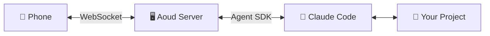

# Aoud

> Control Claude Code from your phone. Send prompts, review diffs, approve changes — all from your pocket.

## How It Works



Your phone connects to the Aoud server on your machine via WebSocket. The server uses the Claude Agent SDK to run prompts against your local project. Responses stream back in real-time — you review diffs, approve file edits, and manage sessions all from your mobile browser.

## Features

- **Real-time Streaming** — Responses appear word by word as Claude generates them
- **Code Diff Viewer** — Syntax-highlighted diffs for every file change before you approve
- **Tool Approval** — Accept or reject file edits and bash commands from your phone
- **Session Persistence** — Resume conversations across sessions with full history
- **Multi-Project Support** — Switch between projects without restarting the server
- **Secure by Default** — Auto-generated auth tokens per instance, optional TLS
- **Remote Access** — Built-in Cloudflare tunnel with QR code (free, no signup)
- **Installable PWA** — Add to your home screen for a native app feel
- **Ticket Tracking** — Built-in ticket system to track tasks and progress
- **Extended Thinking** — See Claude's reasoning process in real-time
- **Slash Commands** — Use `/` commands just like in Claude Code
- **Task Monitoring** — Track progress on multi-step operations
- **Multi-Pane Layout** — Split-view interface for tablets and desktops
- **Terminal Access** — Run bash commands directly from the mobile UI

## Credits

The built-in ticket tracking system is inspired by [tk](https://github.com/h2oai/tk), a lightweight terminal-based ticket manager created by [@lo5](https://github.com/lo5) in Go. We've adapted this concept as an MCP tool for seamless integration with Claude Code.

## Quick Start

### Install

```bash
npm install -g @piraveen98/aoud-code
```

### Start

```bash
aoud start --no-auth
```

### Start with remote access (free, no signup)

```bash
aoud start --tunnel
```

Scan the QR code with your phone. Done.

### Run from source

```bash
git clone https://github.com/pira998/aoud.git
cd aoud
npm install
npm run dev
```

Then open `http://<your-laptop-ip>:3001` on your phone.

## CLI Reference

```bash
# Start
aoud start                        # Local network
aoud start --tunnel               # With Cloudflare tunnel + QR code
aoud start --port 4000            # Custom port
aoud start --project ./my-app     # Specific project directory
aoud start --no-auth              # Disable authentication
aoud start --tls                  # Enable HTTPS
aoud start --tunnel --tunnel-provider ngrok --ngrok-token TOKEN

# Manage
aoud list                         # Show running instances
aoud stop                         # Stop all instances
aoud stop --project ./my-app      # Stop specific instance
aoud info                         # Show connection details

# Config
aoud config --show                # View current config
aoud config --reset-token         # Regenerate auth token
```

## Requirements

- Node.js 18+
- [Claude Code CLI](https://claude.com/code) installed and authenticated

## Environment Variables

| Variable | Description | Default |
|---|---|---|
| `PORT` | Server port | Auto-allocated |
| `AOUD_AUTH_TOKEN` | Auth token | Auto-generated |
| `ANTHROPIC_MODEL` | Claude model to use | `claude-sonnet-4-5-20250929` |
| `ANTHROPIC_BASE_URL` | Custom API endpoint | — |
| `MODEL_CACHE_TTL` | Model list cache duration (ms) | `604800000` (1 week) |

## Project Structure

```
aoud/
├── bin/             # CLI entry point
├── server/          # Aoud server (Node.js, TypeScript, Express, WebSocket)
├── mobile/          # PWA client (React, Vite, Tailwind)
└── shared/          # Shared TypeScript type definitions
```

## Model Configuration

Aoud uses a configuration file to manage model metadata, pricing, and beta features. This makes it easy to add support for new models or beta headers without code changes.

### Quick Configuration

Edit `/server/config/model-overrides.json` to:
- Add new models
- Update pricing
- Enable new beta features (e.g., 2M context when available)
- Customize model aliases

Example: Adding a new beta header
```json
{
  "betaHeaders": {
    "2m-context": {
      "header": "context-2m-2026-03-01",
      "description": "2M token context window",
      "supportedModels": ["claude-opus-5"]
    }
  }
}
```

See [server/CONFIG.md](server/CONFIG.md) for detailed configuration documentation.

## Development

```bash
npm run dev          # Server with hot reload
npm run dev:mobile   # Mobile dev server
npm run dev:all      # Both concurrently
npm run build        # Build everything
npm start            # Run production server
```

## Security

- Auth tokens auto-generated per instance
- All write operations (file edits, bash commands) require explicit mobile approval
- Read-only tools (Glob, Grep, Read, WebSearch) auto-approved
- TLS available via `--tls` flag
- Local network only by default — tunneling is opt-in

## Documentation

- [Architecture](docs/ARCHITECTURE.md)
- [Development Guide](docs/DEVELOPMENT.md)
- [Security](docs/SECURITY.md)
- [Contributing](CONTRIBUTING.md)

## License

MIT
